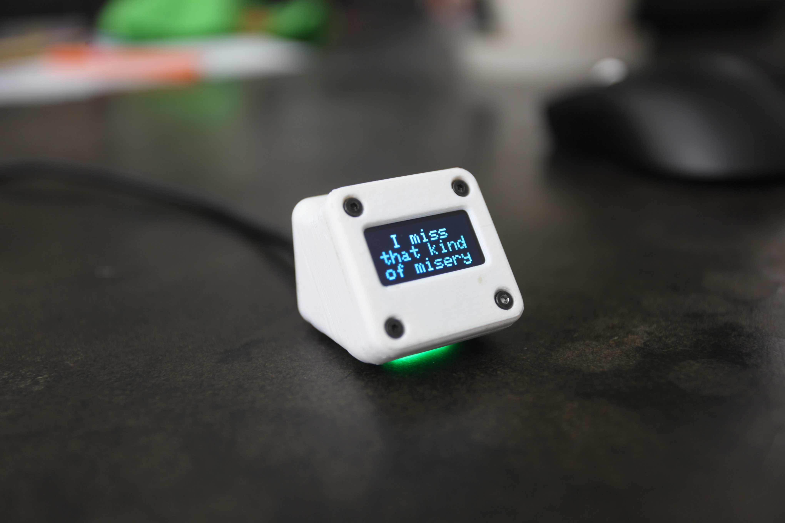
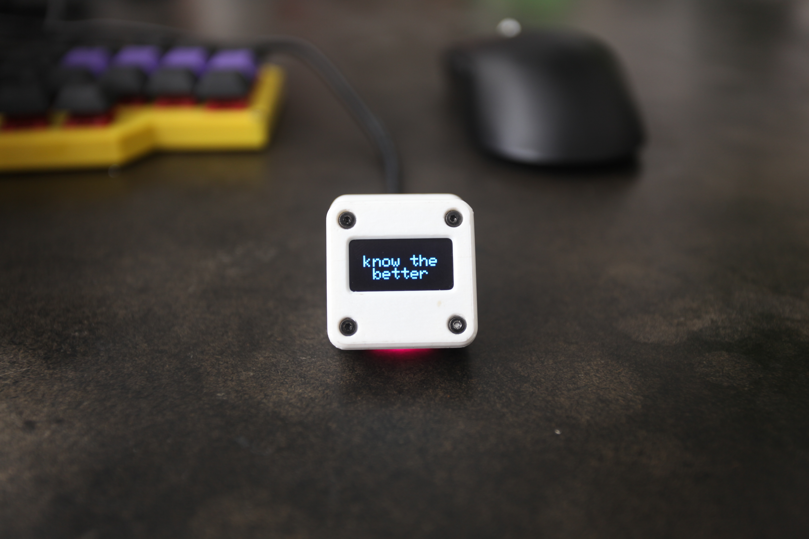
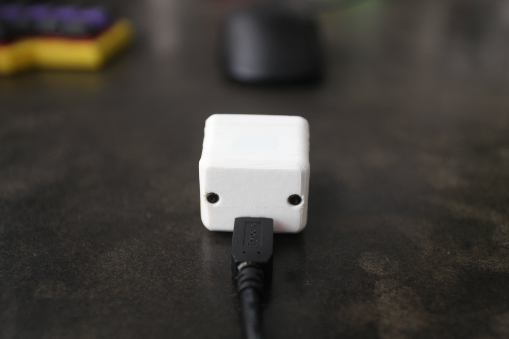
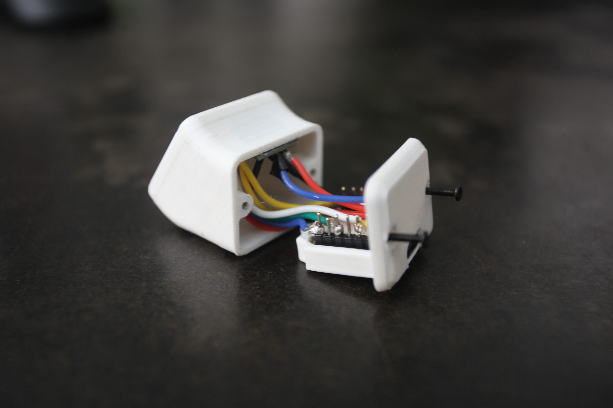

# lyric-pet

> Your Spotify lyrics right on your desk!

A desktop device that displays the lyrics of your currently playing music in
real time! Lyric Pet uses your PC as a host to detect the current Spotify song,
fetch synchronized lyrics and send them to the device over USB.

The lyrics are displayed live on a 0.96” OLED screen as the song plays.

Its is powered by a XIAO RP2040, a 0.96 OLED, and a TTP223 capacitive touch
sensor. Tapping on the top of the device plays/pauses your music, and you can
also switch between different display modes, including a clock.

The built in RGB LED reacts to the lyrics by changing the color when ever a new
lyric line appears.

**You can check the video demo here:** [youtu.be/watch?v=0fgfUwv8](https://www.youtube.com/watch?v=0fgfUwv8_pI)

## Bill of Material

| Part             | Quantity | Price  | Link                                                                |
| ---------------- | -------- | ------ | ------------------------------------------------------------------- |
| XIAO RP2040      | 1        | $6.52  | [mauser.pt](https://mauser.pt/095-0493)                             |
| 0.96 Oled        | 1        | $3.97  | [aliexpress.com](https://aliexpress.com/item/1005009896415869.html) |
| TTP223 Sensor    | 1        | $4.01  | [aliexpress.com](https://aliexpress.com/item/1005009289350723.html) |
| M2x10 Screws     | 6        | $1.95  | [aliexpress.com](https://aliexpress.com/item/1005005618746295.html) |
| 3D Printed Parts | 4        | N/A    | N/A                                                                 |
| **Total:**       |          | $16.45 |                                                                     |

---

## Firmware

The XIAO firmware is at [`Firmware/Device/`](Firmware/Device/). The current one is: `xiao_rp2040_lyrics_u8g2/xiao_rp2040_lyrics_u8g2.ino`

### Build with arduino-cli

```sh
arduino-cli config add board_manager.additional_urls \
  https://github.com/earlephilhower/arduino-pico/releases/download/global/package_rp2040_index.json
arduino-cli core update-index
arduino-cli core install rp2040:rp2040
arduino-cli lib install U8g2 Adafruit_NeoPixel

arduino-cli compile --fqbn rp2040:rp2040:seeed_xiao_rp2040 \
  Firmware/Device/xiao_rp2040_lyrics_u8g2
```

### Flash the .uf2

1. Hold the **BOOT** button on the XIAO while plugging it into USB. It shows
   up as a drive named `RPI-RP2`.
2. Copy the compiled `.uf2` file onto that drive. The XIAO reboots
   automatically and starts running the new firmware.

### Run the host

The computer host is at [`Firmware/Host/`](Firmware/Host/). On Linux it
talks to Spotify using MPRIS.

1. Make sure the **Spotify desktop client** is running and signed in.
2. Set your `SP_DC` cookie in `Firmware/Host/.env` (see
   [`.env.example`](Firmware/Host/.env.example) and the
   [upstream guide](https://github.com/akashrchandran/syrics/wiki/Finding-sp_dc)).
3. Install the dependencies:

   ```sh
   cd Firmware/Host
   python -m venv .venv
   .venv/bin/pip install -r requirements.txt
   ```

   On Linux you also need PyGObject (`python-gobject`) for the MPRIS/D-Bus
   bindings.

4. Plug in the XIAO and start the host:

   ```sh
   cd Firmware/Host
   ./run-device-linux.sh
   ```

   The host detects the XIAO's serial port. If it can't, set `SERIAL_PORT`
   in `.env` (e.g: `/dev/ttyACM0`).

## Overview

|               Images               |
| :--------------------------------: |
|           **Schematic**            |
|  |
|             **Angle**              |
|       |
|             **Front**              |
|       |
|              **Back**              |
|        |
|             **Inside**             |
|      |
|              **Zine**              |
|            |

---
